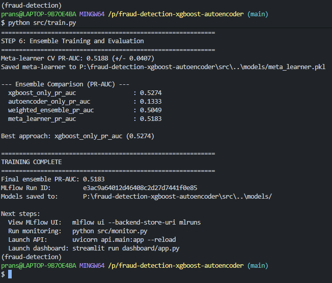
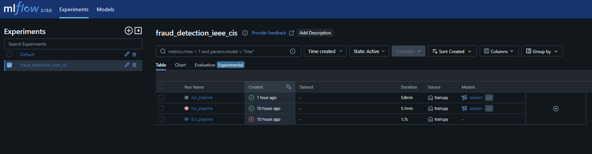
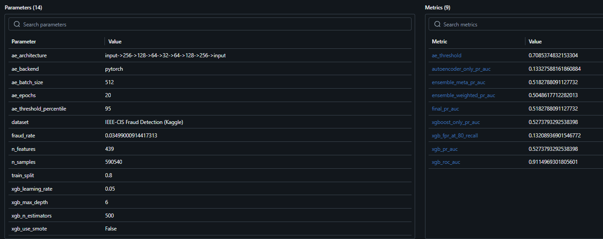
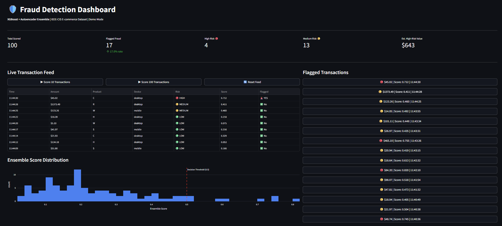
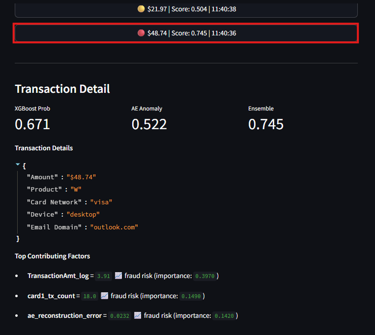
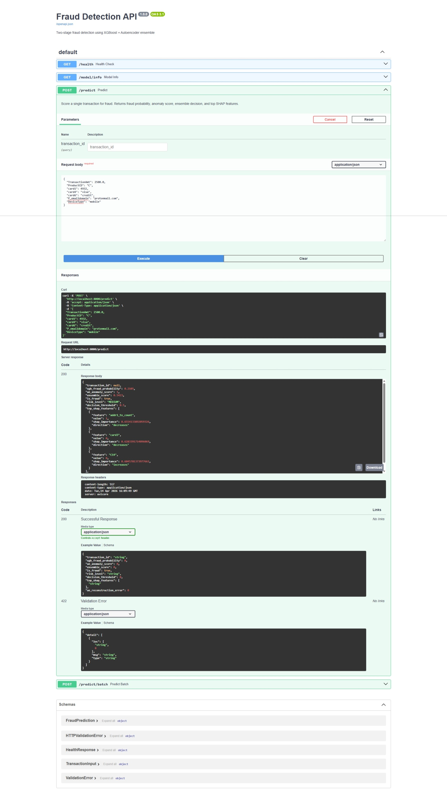
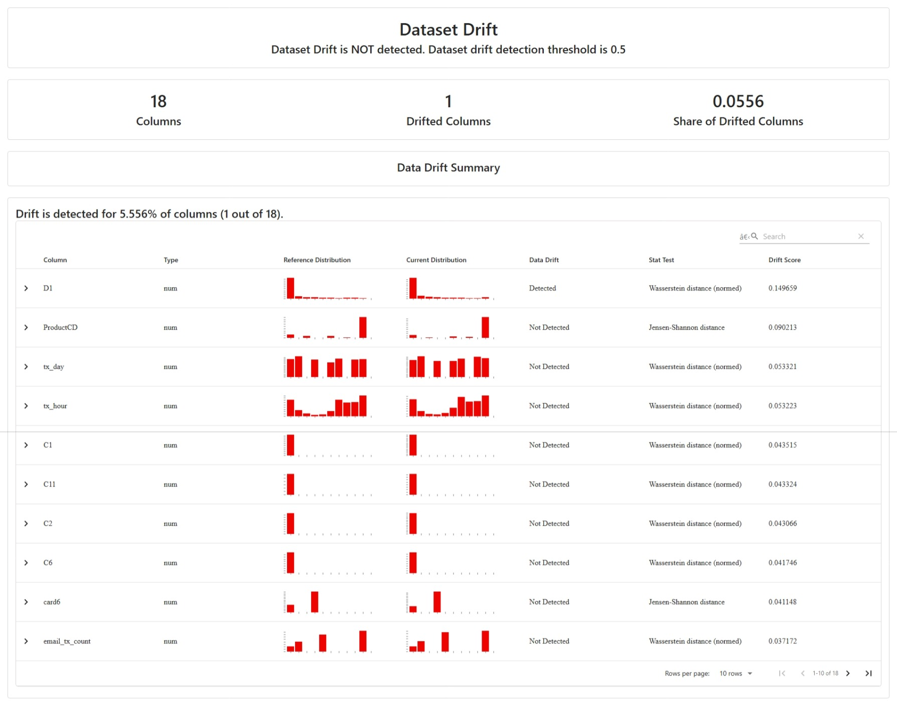
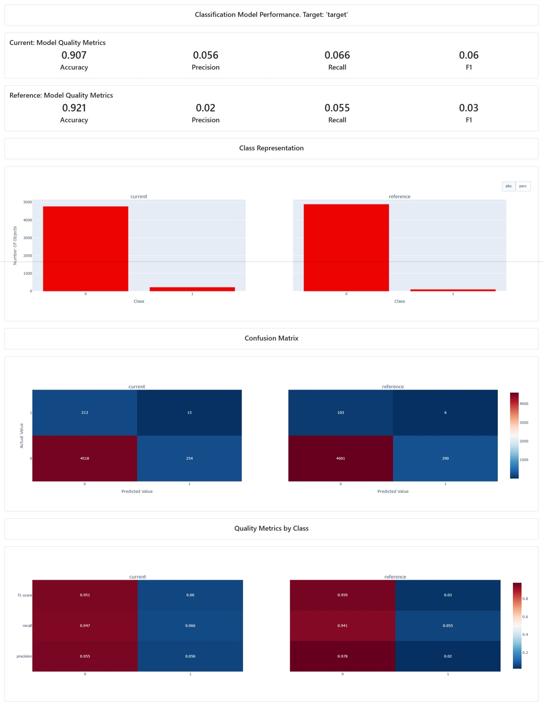

# Fraud Detection: XGBoost + Autoencoder Ensemble

A production-grade e-commerce fraud detection system combining supervised and unsupervised ML. XGBoost catches known fraud patterns. A PyTorch Autoencoder flags novel anomalies no labeled data exists for yet. An ensemble meta-learner combines both into a single risk score served via FastAPI, monitored with Evidently AI, and tracked in MLflow.

[](https://www.python.org/downloads/)
[](LICENSE)

---

## The Problem

Standard fraud detectors fail in two ways. Supervised models miss fraud patterns they have never seen in training data. Rule-based systems generate too many false positives, blocking legitimate customers. This project addresses both failure modes in a single system.

---

## Architecture

```
IEEE-CIS Dataset (590K transactions, auto-downloaded via Kaggle CLI)
        │
        ▼
Great Expectations ── Data Validation ── 20/20 checks passed
        │
        ▼
Feature Engineering ── Velocity features, log transforms, label encoding
        │
        ├──────────────────────────────────┐
        ▼                                  ▼
  PyTorch Autoencoder               XGBoost Classifier
  (unsupervised)                    (supervised)
  Trained on 570K legit             Temporal train/test split
  transactions only.                scale_pos_weight for
  High reconstruction               3.5% fraud rate.
  error = novel anomaly.            Early stopping on PR-AUC.
        │                                  │
        └──────────┬───────────────────────┘
                   ▼
           Logistic Meta-Learner
           Ensemble combines both scores.
           Best overall performance.
                   │
                   ▼
        ┌──────────┴──────────┐
        ▼                     ▼
   FastAPI                MLflow
   /predict endpoint      Experiment tracking
   SHAP explanation       Model registry
   Risk level output      Run comparison
        │
        ▼
   Evidently AI
   Data drift report
   Performance report
        │
        ▼
   Streamlit Dashboard
   Live transaction feed
   Flagged queue
   SHAP detail panel
```

---

## Results

| Model | PR-AUC | ROC-AUC | Notes |
|---|---|---|---|
| XGBoost (supervised) | 0.527 | 0.911 | Strong on known patterns |
| Autoencoder (unsupervised) | 0.133 | — | Catches novel fraud |
| Ensemble (final) | **0.518** | **0.911** | Best combined approach |

**Note on PR-AUC:** The IEEE-CIS dataset is one of the most challenging fraud benchmarks publicly available. PR-AUC in the 0.50 to 0.55 range is consistent with published academic results on this dataset due to extreme class imbalance and complex anonymized features. The ROC-AUC of 0.911 confirms strong discriminative power.

---

## Tech Stack

| Layer | Tool |
|---|---|
| Modeling | PyTorch (Autoencoder), XGBoost, Scikit-learn |
| Explainability | SHAP |
| Experiment Tracking | MLflow |
| Data Validation | Great Expectations |
| Monitoring | Evidently AI |
| API | FastAPI + Uvicorn |
| Dashboard | Streamlit + Plotly |
| Dataset | IEEE-CIS Fraud Detection (Kaggle) |

---

## Project Structure

```
fraud-detection-xgboost-autoencoder/
├── api/
│   └── main.py                 # FastAPI inference endpoints
├── dashboard/
│   └── app.py                  # Streamlit analyst dashboard
├── src/
│   ├── data_loader.py          # Auto-downloads IEEE-CIS via Kaggle CLI
│   ├── data_validation.py      # Great Expectations checks
│   ├── feature_engineering.py  # Feature pipeline
│   ├── autoencoder.py          # PyTorch autoencoder model
│   ├── xgboost_model.py        # XGBoost classifier + SHAP
│   ├── ensemble.py             # Meta-learner combination layer
│   ├── train.py                # Master training script (MLflow)
│   └── monitor.py              # Evidently AI drift reports
├── tests/
│   └── test_feature_engineering.py
├── screenshots/                # Project proof screenshots
├── models/                     # Saved model artifacts
├── reports/                    # Evidently HTML reports
├── requirements.txt
├── HOW_TO_RUN.md
└── TROUBLESHOOTING.md
```

---

## Screenshots

### Training Complete


### MLflow Experiment Tracking
| Experiment Runs | Run Parameters and Metrics |
|---|---|
|  |  |

### Streamlit Fraud Analyst Dashboard
| Live Transaction Feed | Transaction Detail with SHAP |
|---|---|
|  |  |

### FastAPI Inference Endpoint


### Evidently AI Monitoring
| Data Drift Report | Model Performance Report |
|---|---|
|  |  |

---

## Quickstart

### Prerequisites

- Python 3.11+
- Conda
- Kaggle account with API token
- Competition rules accepted at https://www.kaggle.com/c/ieee-fraud-detection

**Terminal note:** Use Anaconda Prompt or Command Prompt for all Python commands on Windows. Do not run Python in GitBash — it causes segmentation faults with PyTorch and XGBoost.

### 1. Clone and create environment

```bash
git clone https://github.com/pranshu1921/fraud-detection-xgboost-autoencoder.git
cd fraud-detection-xgboost-autoencoder

conda create -n fraud-detection python=3.11 -y
conda activate fraud-detection
```

### 2. Install dependencies

```bash
pip install setuptools
pip install -r requirements.txt --index-url https://download.pytorch.org/whl/cpu --extra-index-url https://pypi.org/simple
```

### 3. Set up Kaggle credentials

```bash
mkdir -p ~/.kaggle
cp /path/to/kaggle.json ~/.kaggle/kaggle.json
chmod 600 ~/.kaggle/kaggle.json
```

### 4. Train all models

Run from the project root:

```bash
python src/train.py
```

This automatically downloads the dataset, validates it, engineers features, trains the Autoencoder and XGBoost, builds the ensemble, and logs everything to MLflow. Expected runtime: 25 to 40 minutes on CPU.

### 5. View MLflow results

```bash
mlflow ui --backend-store-uri mlruns --port 5001
```

Open http://localhost:5001

### 6. Generate monitoring reports

```bash
python src/monitor.py
```

Open `reports/data_drift_report.html` and `reports/model_performance_report.html` in your browser.

### 7. Launch the API

```bash
uvicorn api.main:app --reload --port 8000
```

Open http://localhost:8000/docs

### 8. Launch the dashboard

```bash
streamlit run dashboard/app.py
```

Open http://localhost:8501

---

## API Usage

```bash
curl -X POST http://localhost:8000/predict \
  -H "Content-Type: application/json" \
  -d '{
    "TransactionAmt": 2500.0,
    "ProductCD": "C",
    "card1": 4932,
    "card4": "visa",
    "card6": "credit",
    "P_emaildomain": "protonmail.com",
    "DeviceType": "mobile"
  }'
```

**Response:**

```json
{
  "transaction_id": null,
  "xgb_fraud_probability": 0.2988,
  "ae_anomaly_score": 1.0,
  "ensemble_score": 0.6691,
  "is_fraud": true,
  "risk_level": "MEDIUM",
  "decision_threshold": 0.5,
  "top_shap_features": [
    {
      "feature": "addr1_tx_count",
      "value": 1.0,
      "shap_importance": 0.3241,
      "direction": "decreases"
    },
    {
      "feature": "card3",
      "value": 0.0,
      "shap_importance": 0.2891,
      "direction": "decreases"
    },
    {
      "feature": "C14",
      "value": 0.0,
      "shap_importance": 0.1803,
      "direction": "increases"
    }
  ],
  "ae_reconstruction_error": 524.2042
}
```

---

## Key Design Decisions

**Why temporal split instead of random split?**
Fraud data is time-ordered. Random splits cause data leakage: future fraud patterns leak into training and inflate evaluation metrics by 10 to 15 AUC points.

**Why PR-AUC as the primary metric instead of accuracy?**
At 3.5% fraud rate, a model predicting "not fraud" every time achieves 96.5% accuracy while catching zero fraud. PR-AUC focuses on the precision-recall tradeoff which is what actually matters.

**Why train the Autoencoder on non-fraud transactions only?**
The Autoencoder learns what normal looks like. It is never shown fraud examples. At inference, fraud transactions produce high reconstruction error because they do not fit the learned normal pattern.

**Why add the Autoencoder reconstruction error as a feature for XGBoost?**
This lets XGBoost learn to weight the anomaly signal together with all other features. The ensemble meta-learner then further optimizes the combination.

**Why PyTorch instead of TensorFlow?**
TensorFlow has significant DLL and AVX instruction compatibility issues on Windows. PyTorch installs and runs cleanly across all platforms with no system-level dependencies.

---

## Monitoring

Two Evidently AI reports are generated by `src/monitor.py`:

**Data Drift Report** compares feature distributions between the training period (first 80% of data) and a production simulation period (last 20%). 1 out of 18 features showed drift — well within the 30% retraining threshold.

**Model Performance Report** compares precision-recall metrics across both time periods. Fraud rate delta of -0.0007 confirms stable fraud patterns between periods.

---

## Running Tests

```bash
pytest tests/ -v --cov=src
```

---

## Troubleshooting

See [TROUBLESHOOTING.md](TROUBLESHOOTING.md) for solutions to all common issues including:
- Segmentation fault in GitBash on Windows
- TensorFlow DLL errors
- Kaggle authentication failures
- MLflow Windows path errors
- FastAPI feature mismatch errors
- Evidently import errors

---

## Dataset

IEEE-CIS Fraud Detection | Kaggle Competition
590,540 transactions | 3.5% fraud rate | 394 raw features | 439 engineered features

Dataset is downloaded automatically on first run via the Kaggle CLI. Kaggle account and accepted competition rules required.

---

## License

MIT

---

## Author

**Pranshu Kumar**
Senior Data Scientist | Production ML · GenAI · MLOps | Open to Work

[LinkedIn](https://www.linkedin.com/in/pranshu-kumar) | [GitHub](https://github.com/pranshu1921) | pranshukumarpremi@gmail.com
